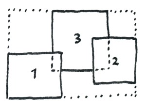
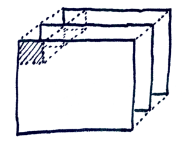

# About

The StackComposed compute the stack composed of a specific statistic of band values for several time series of georeferenced data (such as Landsat images), even if these are in different scenes or tiles. The result is a output of statistic compute for all valid pixels values across the time axis (z-axis), in the wrapper extent for all input data in parallels process.

The main aim of this app are:

* Improve the velocity of compute the stack composed

* Compute several statistics in the stack composed easily.

* Compute a stack composed for data in different position/scenes using a wrapper extent.

* Include the overlapping areas for compute the statistics, e.g. two adjacent scenes with overlapping areas.

* Compute some statistics  that depend of time data order (such as last valid pixel, pearson correlation) using the filename for parse metadata (for now only for Landsat images)

## Process flow

The general process flow is:

* Read all input data (but not load the raster in memory)

* Calculate the wrapper extent for all input data

* Position each data in the wrapper extent (the app does not exactly do this, use a location for extract the chunk in the right position in wrapper, this is only for understand the process)

* Make the calculation of the statistic in parallel process by chunks

* Save result with the same projection with the wrapper extent

### Compute the wrapper extent

The wrapper extent is the minimum extent that cover all input images, in this example there are 3 scenes of the images with different position, the wrapper extent is shown in dotted line:

The wrapper extent is the size for the result.

### Data cube process

With the wrapper extent then the images are located in a right position in it and put all images in a stack for process, the images are ordered across the time like a cube or a 3D matrix. When compute a statistic, it process all pixel for the wrapper extent, first extract all pixel values in all images in their corresponding position across the z-axis, for some images this position don't have data, then it return a NaN value that is not included for the statistic.

### Parallelization

There are mainly two problems for serial process (no parallel):

- When are several images (million of pixels) required a lot of time for the process
- For load several images (data cube) for process required a lot of ram memory for do it

For solved it, the StackComposed divide the data cube in equal chunks, each chunks are processes in parallel depends of the number of process assigned. When one chunk is being process, it load only the chunk part for all images and not load the entire image for do it, with this the StackComposed only required a ram memory enough only for the sizes and the number of chunks that are currently being processed in parallel.

